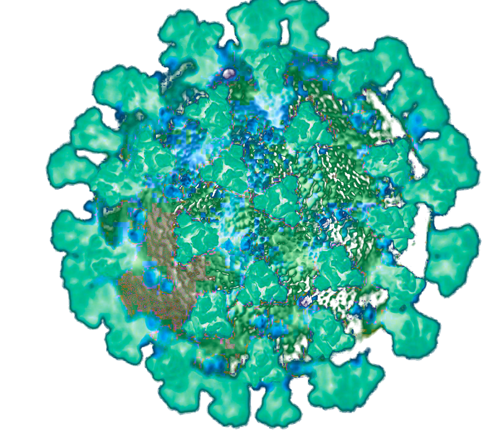

<p align="center">
  
   <h3 align="center">A Thin Python Wrapper for the COVID-19 API of the Robert Koch Institute, Germany.</h3>
<p>

<!-- <p id="Badges" align="center">
  <a alt="Platform" href="https://pypi.org/project/covid19pyclient/">
    
  </a>
  <a alt="GH actions" href="https://github.com/NiklasTiede/covid19pyclient/actions">
    
  </a>
  <a alt="GH Release" href="https://github.com/NiklasTiede/covid19pyclient/releases">
    
  </a>
  <a alt="Codecov" href="https://app.codecov.io/gh/NiklasTiede/covid19pyclient">
    
  </a>
</p> -->

A Python Wrapper for the [COVID-19 API]()!

<!-- PYPI-DOCS:START -->

# Example

```python
import covid19pyclient

print(covid19pyclient.__version__)
```

# Contents
- [Features](#features)
- [Installation](#installation)
- [How to use covid19pyclient](#how-to-use-covid19pyclient)

# Features


# Installation

You can install COVID-19 API Python Client with pip.

```python
$ pip install covid19pyclient
```

# How to use covid19pyclient


<!-- PYPI-Docs:END -->
